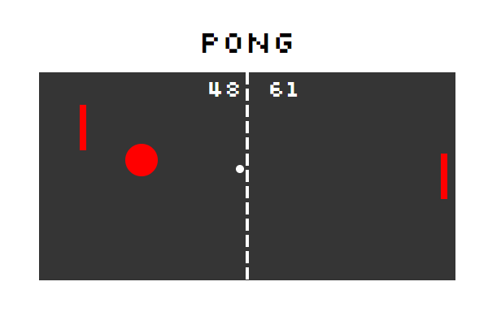

# Pong Game

A basic pong game using SVGs.

## Setup

**Install dependencies:**

`> npm i`

**Run locally with Webpack Dev Server:**

`> npm start`

**Build for production:**

`> npm run build`

## Keys

**Player 1:**
* a: up
* z: down
* q: special move

**Player 2:**
* ▲: up
* ▼: down
* p: special move

## Special move

* By pressing the special move key, paddle move forward with 40px.
* Ball collision with special move paddle change color to red, and ball speed times 2.
